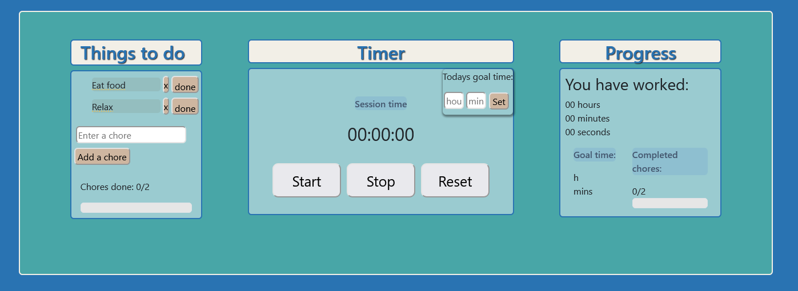

# $\textsf{\color{#2973B2}{To Do List}}$ ✔️

This project is about testing and building React app

## $\textsf{\color{#48A6A7}{Features:}}$

- Add chores and track them, delete and set status 'done'
- Set goal time and track time with the stop watch timer.  
  Resetting the timer will not reset whole time progress
- Choose color themes

## $\textsf{\color{#48A6A7}{Things to add:}}$

- visual time tracker in the progress container
- Drag and drop feature for chores

---

Here is the link to see the page:
https://kaunfell.github.io/To-Do-List/
